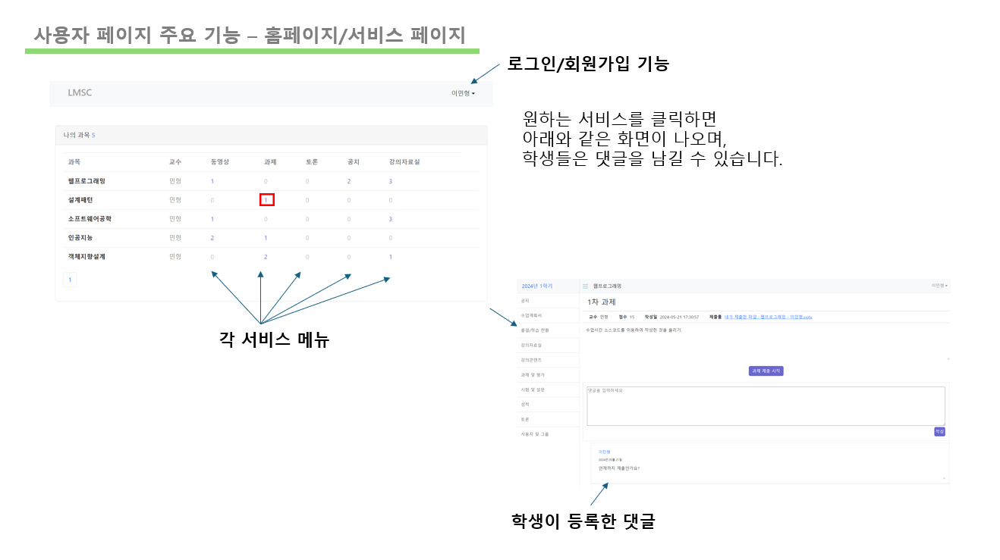
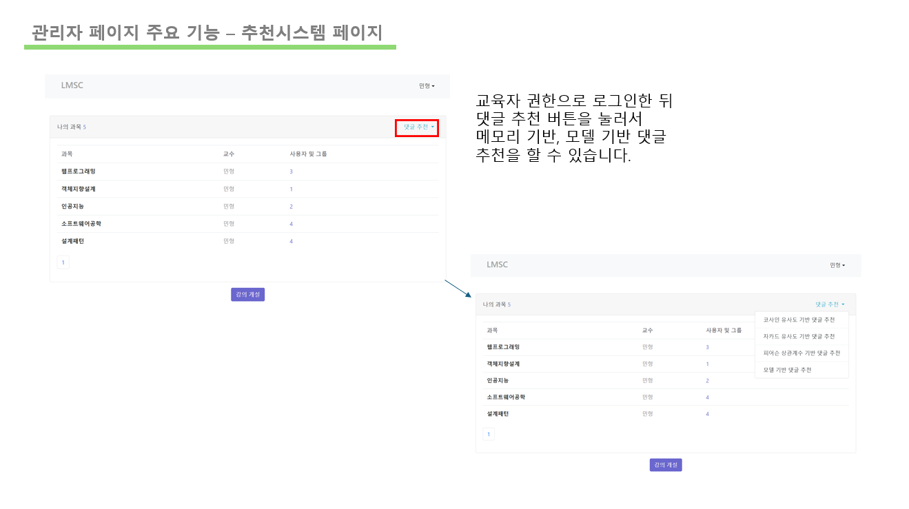
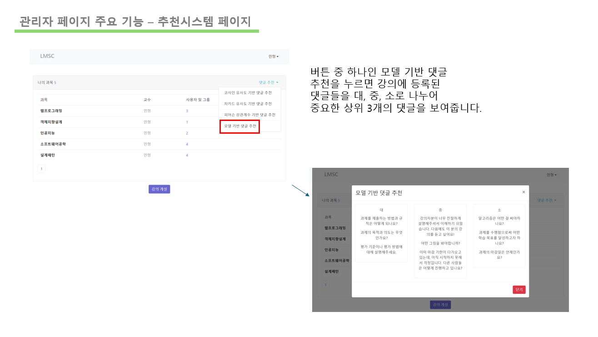

## 프로젝트 목적

    본 프로젝트의 목적은 기존 LMS(Learning Management System) 사이트의
    불편함을 개선하여 사용자 경험을 극대화하는 것입니다. 
    LMS는 교육과 학습을 위한 중요한 도구로 자리잡고 있으나
    학생과 교육자 간의 원활한 소통 부족과 사용자 편의성 측면에서 개선이 필요합니다. 
    본 연구에서는 추천 알고리즘을 활용한 질문 처리 시스템을 도입하여 이러한 문제를 해결하고,
    사용자 간의 상호작용을 강화함으로써 학습 능력 향상을 도모하고자 합니다.

## 설명

1. 문제점 분석
   1. 학생과 교육자 간의 소통 부족: 기존 LMS 사이트에서는 학생과 교육자 간의 원활한 의사소통이 부족하여 학습 효과가 저하되는 문제가 있습니다.
   2. 일괄 처리 기능 부족: 학생들의 질문에 대해 효율적으로 답변할 수 있는 시스템이 부족합니다.
   3. 답글 확인의 어려움: 학생들이 질문에 대한 답변을 쉽게 확인할 수 있는 시스템이 부족합니다.

2. 해결 방안
   1. 추천 알고리즘 적용: 추천 알고리즘을 활용하여 학생들의 질문을 입력받고, 유사하고 빈번하게 나오는 질문 몇 가지를 자동으로 선별합니다. 이를 교육자에게 제공하여 효율적인 소통을 가능하게 합니다. 
   2. 질문 처리 시스템 개선: 질문 답변 시스템을 개선하여, 학생들이 질문을 쉽게 입력하고, 교육자가 효율적으로 답변할 수 있는 시스템을 도입합니다. 
   3. 소통 강화: 교육자와 학생 간의 소통을 강화하여, 학습 과정에서 발생하는 문제를 신속하게 해결할 수 있도록 합니다.

## 사용된 기술

- Spring Boot
- Spring MVC
- Spring JDBC
- MYSQL - SQL
- thymeleaf 템플릿 엔진
- Deep Learning
- Python
- Flask
- Siamese Network
- Dezero
- BERT

## 아키텍처

1. 요청 흐름

        브라우저에서 요청이 발생합니다.
        요청은 Controller로 전달됩니다.
        Controller는 Service 계층으로 요청을 전달합니다.
        Service 계층은 Repository 통해 데이터베이스와 상호작용합니다.
        Repository는 MySQL 데이터베이스에 접근하여 필요한 작업을 수행합니다.

2. 응답 흐름

        Repository에서 데이터를 가져와 Service 계층으로 전달합니다.
        Service 계층은 데이터를 Controller로 전달합니다.
        Controller는 템플릿 엔진을 사용하여 데이터를 뷰에 전달합니다.
        브라우저에 응답이 반환됩니다.

3. 데이터전송

        레이어 간에 데이터는 DTO를 통해 전송됩니다.

## 주요 기능

1. 사용자 페이지
   

2. 교육자 페이지

   

   
