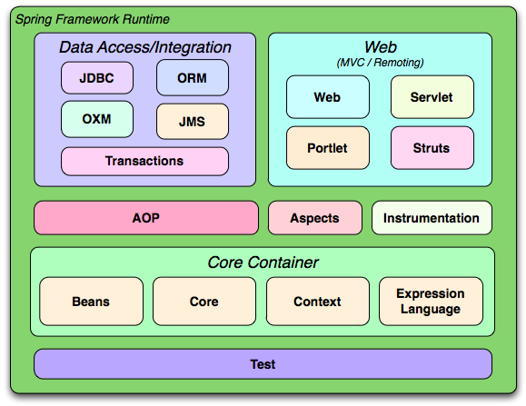

## ApplicationContext

ApplicationContext를 구현하고 있는 대표적인 클래스
org.springframework.context.support
Class ClassPathXmlApplicationContext

## 

- Core Container가 핵심
- 외부 개발을 위한 MVC관련 라이브러리
- 데이터베이스 정보를 읽어오기 위한 것들
